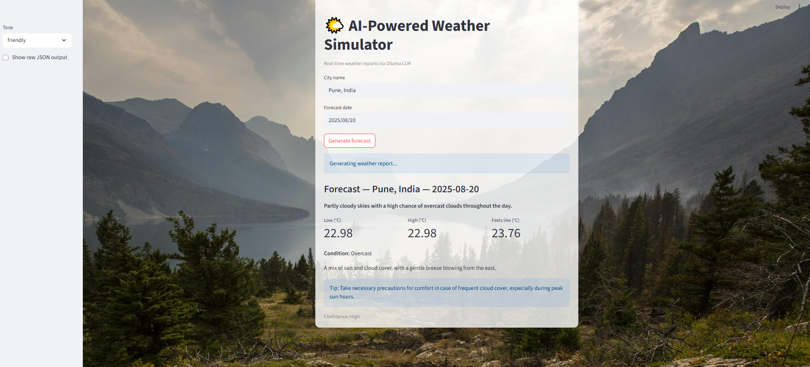

# 🌤️ AI-Powered Weather Simulator

An interactive **Streamlit app** that combines **OpenWeatherMap API**
with **Ollama LLM (Llama 3.2)** to generate **human-friendly,
AI-enhanced weather forecasts**.\
You can choose the tone of the forecast (friendly, professional,
playful, or concise) and get real-time insights with helpful tips.

------------------------------------------------------------------------

## ✨ Features

-   🌍 Real-time weather data via OpenWeather API\
-   🧠 AI-enhanced natural language forecasts with Ollama\
-   🎨 Beautiful UI with background image and metrics display\
-   ⚡ JSON-safe response handling\
-   🎭 Multiple tone options (friendly, professional, playful, concise)

------------------------------------------------------------------------

## 📸 Screenshot

Here's what the app looks like:



------------------------------------------------------------------------

## 🚀 Installation

1.  Clone the repository:

    ``` bash
    git clone https://github.com/<your-username>/<repo-name>.git
    cd <repo-name>
    ```

2.  Create a virtual environment (recommended):

    ``` bash
    python -m venv venv
    source venv/bin/activate   # macOS/Linux
    venv\Scripts\activate      # Windows
    ```

3.  Install dependencies:

    ``` bash
    pip install -r requirements.txt
    ```

4.  Set your environment variable in a `.env` file:

    ``` env
    OPENWEATHER_API_KEY=your_openweather_api_key_here
    ```

------------------------------------------------------------------------

## ▶️ Running the App

Make sure [Ollama](https://ollama.ai) is installed and running locally.\
Then start the Streamlit app:

``` bash
streamlit run app.py
```

------------------------------------------------------------------------

## 🛠️ Tech Stack

-   **Python 3.13.5**
-   **Streamlit** --- UI framework\
-   **Ollama (Llama 3.2:1b)** --- AI model for weather narration\
-   **OpenWeather API** --- Real-time weather data\
-   **dotenv** --- Manage environment variables

------------------------------------------------------------------------

## 📜 License

This project is licensed under the MIT License --- feel free to use and
modify.
